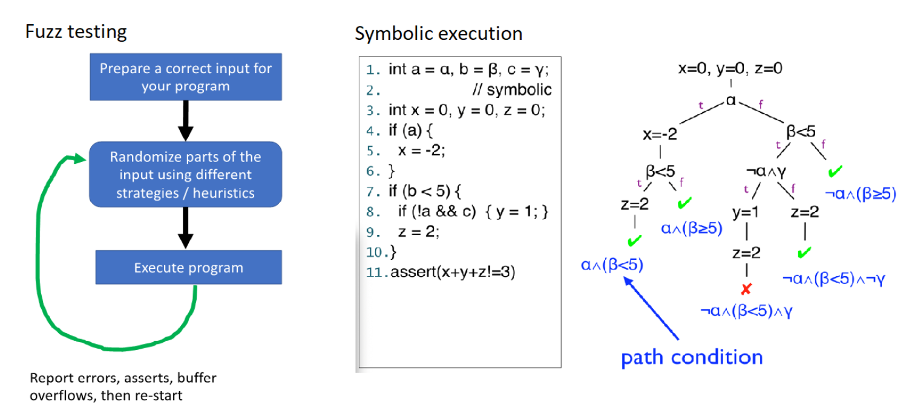
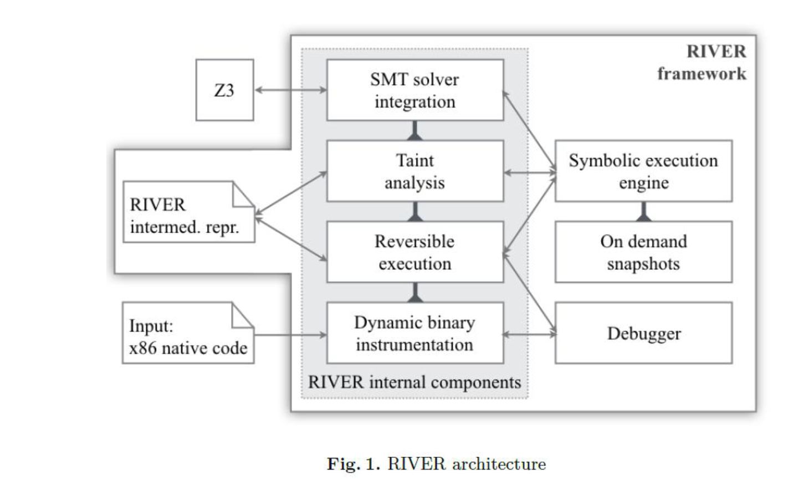
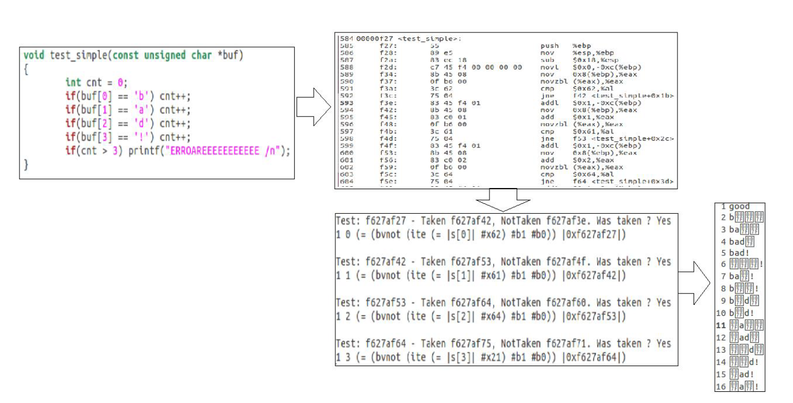

# How to find bugs in your (x86) code RIVER tool

## Project members:
 1. Ceachi Bogdan (developer)
 2. Ciprian Paduraru (coordinator)
 
 ## Project code
 1. River: https://github.com/AGAPIA/river
 2. SimpleTracer: https://github.com/AGAPIA/simpletracer
 3. Main code in this github (must be added)
 For the algorithm (not the full project): https://github.com/Ceachi/Dissertation-Project-Concolic-Execution-using-River/tree/master/concolic_execution_algorithm/testingExecution
 
 ## Introduction
 
 The purpose planned with River by us (and the entire suite of tools) is to create a free, open source platform, for fuzzing, symbolic and concolic execution at the level of the online service paid by Microsoft Security. It’s deployment will be online with a web service, preinstalled docker image or buildable source code.  
 
 We present a binary analysis framework based on symbolic execution with the distinguishing capability to execute stepwise forward and also backward through the execution tree. It was developed internally at Bitdefender and code-named RIVER [1]. The framework provides components such as a taint engine, a dynamic symbolic execution engine, and integration with Z3 for constraint solving.  
 
 ## Part 1 - Foundations
 
 []
 
  Almost all the tools on the security market which aim to detect vulnerabilities of source or binary code employ static analysis or, more rarely, dynamic analysis through random values, a technique called fuzz testing.  
 Symbolic execution(an example can be seen in the right image in the figure) is a promising approach whose foundational principles were laid thirty years ago, but which only recently started to regain attention from the research community due to advancement in constraint solving, various combinations of concrete and symbolic execution, and more computing power to fight the usual state explosion problem. The basic idea of symbolic execution is to mark (some of) the program
variables as symbolic rather than concrete and execute the program symbolically by accumulating constraints on those variables along the different paths explored in the execution tree. The main challenges of symbolic execution are the path explosion, constraint solving and memory modeling.  
  Most of the symbolic execution tools work on source code or bytecode rather than binary code. However, binary code analysis is a very difficult task due to its complexity and lower level constructs. On the other hand, it is better to run the analysis directly at binary level, because this is the code which is executed by the operating system. Moreover, in the cybersecurity domain, in most cases, only the binary file is available for scrutiny, so recent research efforts are invested into dynamic analysis of binary files with some companies such as Bitdefender joining the trend.  
  
  Another possible solution is using concolic execution(combination between symbolic execution and concrete execution). Instead of being 100% symbolic, the inputs have a concrete value, which is a representative for a symbolic variable (taint analysis is needed to track the symbolic variables). So, with concolic execution, we can reach deep code in each execution, because it assigns concrete values to symbolic variables then continue. We can also get good code coverage of our program much faster, but we need a lot of resources to explore all the paths: time needed to restart, memory needed for snapshots.  
  
 ## Overview about River execution:
 
 []
 Basic blocks translation - Each time when a new block is given for execution (and not in the cache):
  - the code is disassembled from x86 and converted to River instruction code;
  - Pre instructions are decorated;
  - stack instructions are decorated to use River's own stack;
  - code is assembled back using X86Assembler component for both FORWARD and BACKWARD;
 
Our “Reversible execution engine” uses a shadow stack to save instruction operands that are about to be destroyed, prefix original instructions operand-saving ones and generate code for reversing the execution (restores destroyed values from the shadow stack.  

Results from our optimized concolic execution engine:
]

At this moment, we managed to implement some optimizations in concolic execution techniques inspired from SAGE [2], that is not open-source, with similar results, and we are working for other subsequent optimizations published by the same author. What we need, however to be competitive in performance and to be able to publish something on the research side (not just another similar tool – which would have the advantage of being open source free):  

- re-analyzing the binary loader for direct execution, simplifying the practice of redesigning instructions and avoiding unnecessary product care operations (for example, we don’t need the code back to the base block).
- For symbolic execution, we need to repair the backward code and use it together with the debugger. That would be something new that the industry has to report on, i.e. instead of saving snapshots, we can return to the previous states by running the backward code of the previously executed code.  
- Implement parallel symbolic execution based on the algorithm already implemented. We will expect to see good code coverage in shorter time / less resources used:  
  -  Centralized architecture: to store a (synchronized) probabilities map to know how many times a branch path was evaluated. Also, master coordinates machines to paths explored rarely;  
  - Decentralized architecture: use the same probability map on each individual process. Machines explore paths depending on this map and from time to time they exchange the probability map;  
  - Combine ideas from Cloud9, MAYHEM + reversible execution – less communication overhead since we use reversible execution (better speedup).  

## Some research ideas:  
 - Use a reinforcement learning policy to control state explosion (one model per application)
 - Action decision: which state to execute next in the current context  
 - Observations:
   - Minimum distance to an uncovered instruction
   - Call stack information – size, depth, etc
   - How recent did the state covered new code  
   - Rewards:  
      - Positive - # new branches / instruction discovered  
      - Negative – blocked in a tight loop
   - Use Autoencoders to create latent representation of input examples, then use it as a generative model
   
 ## Articles:
 1. RIVER: A Binary Analysis Framework using Symbolic Execution and Reversible x86 Instructions, Teodor Stoenescu , Alin Stefanescu , Sorina Predut, Florentin Ipate (http://www.ifsoft.ro/~florentin.ipate/publications/RiverFM16.pdf)  
 2. Automated Whitebox Fuzz Testing, Patrice Godefroid Microsoft (Research), Michael Y. Levin Microsoft (CSE), David Molnar UC Berkeley (https://patricegodefroid.github.io/public_psfiles/ndss2008.pdf)  
 

 
 
 
